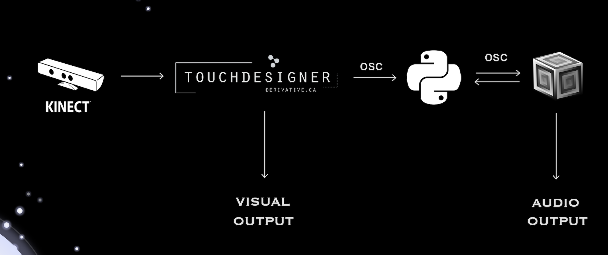

# χαρμολύπη (Charmolypi)
### Abstract
***χαρμολύπη*** is an interactive artistic experience aiming to explore the *beauty of closeness* in the context of human relationships. 

The loss of social connection often leads to feeling lonely and pained. Relationships are the expression of the choice to risk start losing something personal in exchange for making space for something enriching. 

Distance is hereby understood as solitude: individuals are self-contained beings when apart but when they choose to start getting closer to one another, an exchange gradually happens. This exchange will inevitably translate into the opening of their respective boundaries, sharing parts of themselves to receive something valuable in exchange. 

The intention behind this project is to explore and abractly represent what humans possess and can choose to share of themselves, enhancing the value of the enriching effect closeness in relationships has on the individual. 
## 
### Final Purpose and Achievement

The **final purpose** of the installation is for the user to perceive *human connection* as something *empowering* and *valuable* and to highlight the joy that comes from choosing to transition from solitude to community. Closeness, sharing and openness are all choices that the installation wants to promote and encourage. 

To achieve this, the installation exploits human-to-human interaction and both visual and audio implementations dynamically evolve contributing to make the users perceive closeness and connection as something valuable and energising 

##  
Final project for the '_Creative Programming and Computing_' course of MSc. in _Music and Acoustic Engineering @ Politecnico di Milano_ (a.y. 2023/2024) held by [Prof. Massimiliano Zanoni](http://www.massimilianozanoni.it). 

Developed by:

- [Emma Coletta](https://github.com/emmaclt)
- [Enrico Dalla Mora](https://github.com/EnricoDallaMora)
- [Federico Ferreri](https://github.com/federicoalferreri)
- [Lorenzo Previati](https://github.com/LorenzoPreviati22)

## Links
- [Project Proposal Presentation](./prototipo_cpac.pdf)
- [Final Project Presentation]()
- [📄Report]()
- [🎞️Video Demo]()

## Flowchart and Technical Summary
<!--

-->

##

### Hardware and Software Implementation

Our testing and development setup involved:
- [Xbox Kinect Technology](https://en.wikipedia.org/wiki/Kinect)
  - motion and distance detection 
- [TouchDesigner by Derivative.ca](https://derivative.ca)
  - motion and distance mapping
  - visual and graphics
- [Python](https://www.python.org/downloads/)
  - variable markov chain algorithm implementation
  - music sequence generation and composition
- [SuperCollider](https://supercollider.github.io)
  - sound synthesis
  - audio output
- [Open Sound Control](https://opensoundcontrol.stanford.edu/index.html)
  - networking and communication protocol

### External Resources
- [MAESTRO-v3.0.0 dataset](https://magenta.tensorflow.org/datasets/maestro#v300) [^1] by [Magenta](https://github.com/magenta/magenta)
  - midi files used to generate music sequences
<!--- [Markov Chain?]()-->

### Dependencies 
- Python
  - [Mido - MIDI Objects for Python](https://github.com/mido/mido)
  - [pyOSC3](https://github.com/Qirky/pyOSC3.git)

## Final Considerations
### Known Issues

### Possible Improvements

## Run on your machine

### Requirements
- Hardware
  - Microsoft Kinect Xbox 360
- Software:
  - TouchDesigner: [download](https://derivative.ca/download)
  - Python: [download](https://www.python.org/downloads/)
  - SuperCollider: [download](https://supercollider.github.io/downloads)
  - Python Dependencies

### How to
1. Get yourself a Kinect motion sensor
2. Make sure you have all software requirements mentioned above installed
3. Set up your hardware and software (TouchDesigner) communication
4. Execute the first ... lines of [new.scd](./new.scd)
5. Run [play_enrico.py](./play_enrico.py)
6. Execute the rest of [new.scd](./new.scd)
7. Everything should be up and running now! Have fun playing around with the installation and seeing how both visual and audio dynamically evolve accordingly to the interaction happening between you and other user(s).
---
### Bibliography
[^1]: Curtis Hawthorne, Andriy Stasyuk, Adam Roberts, Ian Simon, Cheng-Zhi Anna Huang,
  Sander Dieleman, Erich Elsen, Jesse Engel, and Douglas Eck. "Enabling
  Factorized Piano Music Modeling and Generation with the MAESTRO Dataset."
  In International Conference on Learning Representations, 2019.

